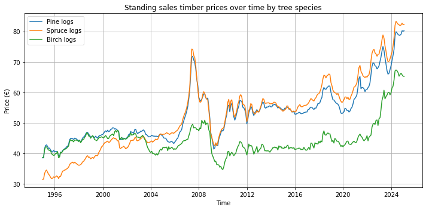
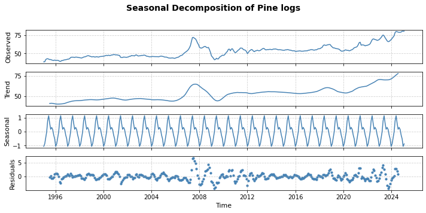
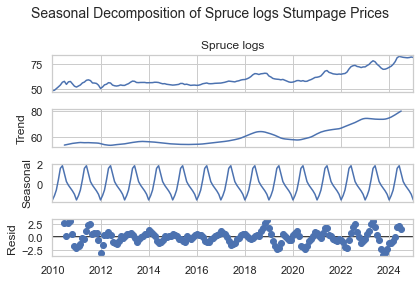
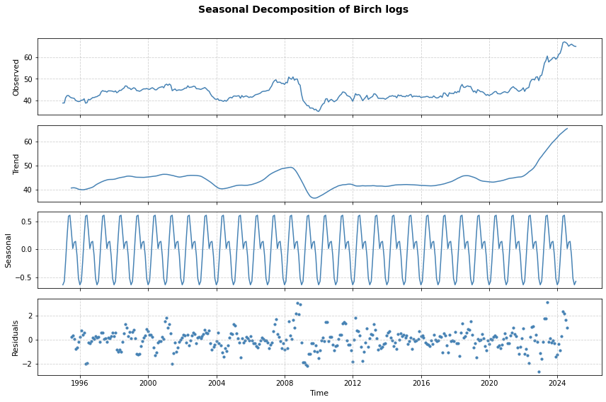
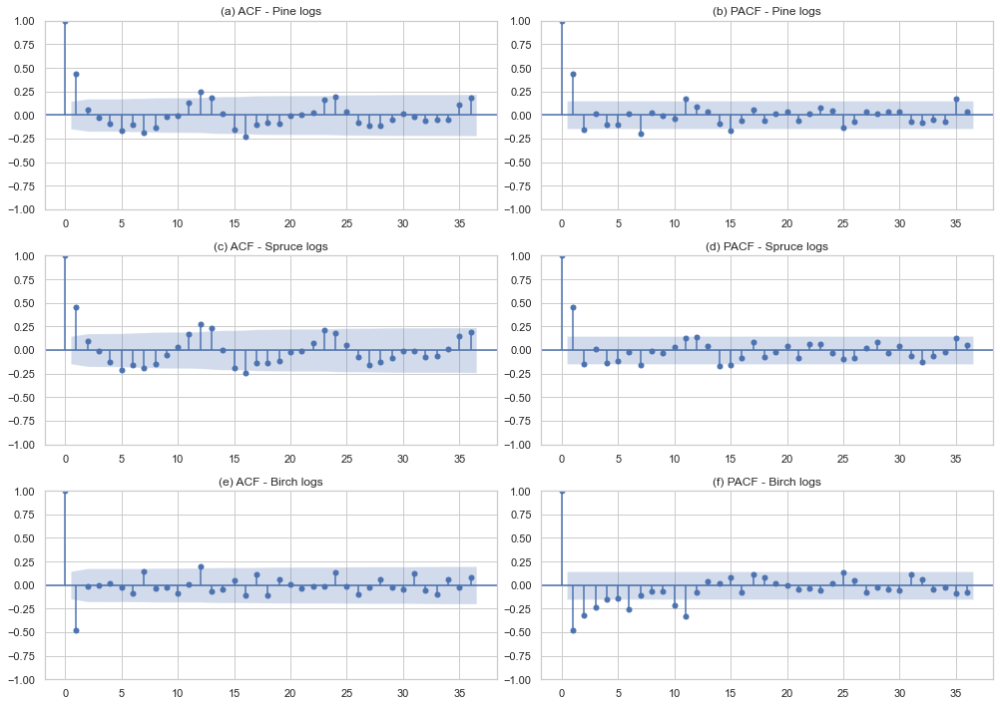
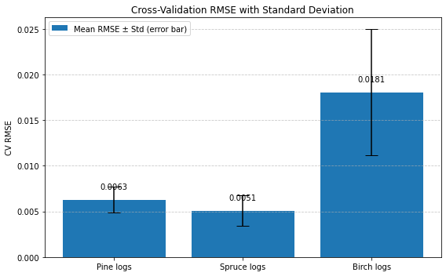
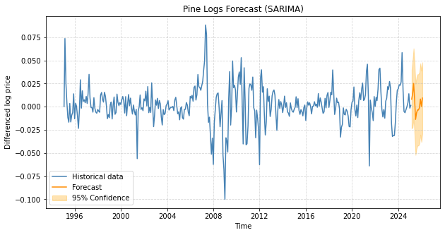
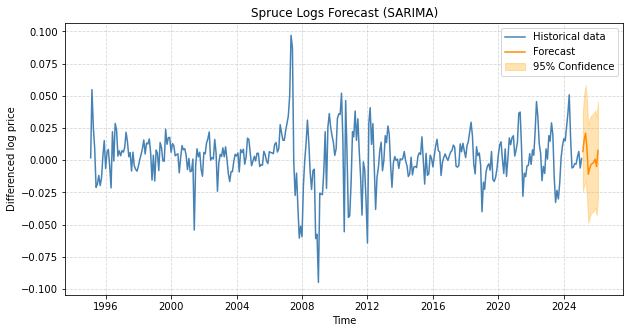
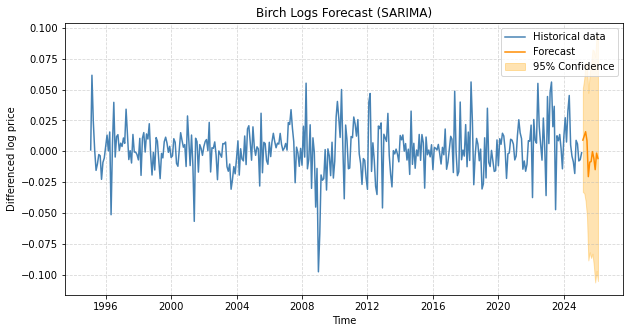

# Forestry Project: Forecasting Timber Prices in Finland Using SARIMA 
## Abstract
This project analyzes monthly stumpage prices of pine, spruce, and birch logs in Finland (1995–2025). After transforming and validating stationarity, SARIMA models were used to forecast timber prices. Model accuracy was assessed with MAE, RMSE, and rolling cross validation. Results show pine and spruce prices are more predictable than birch, offering insights into market dynamics.
## Project objective
This project aims to model and forecast monthly timber prices in Finland using SARIMA, focusing on differences in predictability across pine, spruce, and birch logs.
## Analysis workflow
### 1. Data overview and preparation

Timber price data is extracted from [LUKE](https://statdb.luke.fi/PxWeb/pxweb/en/LUKE/LUKE__04%20Metsa__04%20Talous__02%20Teollisuuspuun%20kauppa__02%20Kuukausitilastot/01a_Kantohinnat_kk.px/?rxid=dc711a9e-de6d-454b-82c2-74ff79a3a5e0) The dataset includes monthly standing sales prices (€) of three timber species in Finland: pine logs, spruce logs and birch logs. It spans from January 1995 to February 2025, covering a total of 362 months. Each log type has consistent data without missing values.

Pine logs have thighest average price (53.0 €), with prices ranging from 36.8 to 80.2 €. Spruce logs have slightly lower mean prices (52.7 €), but the largest variation. Birch logs are the least expensive (44.6€), with a narrower price spread.

Table 1. Statisitcs summary of timber prices with three logs
|       |   Pine logs |   Spruce logs |   Birch logs |
|-------|-------------|---------------|--------------|
| count |   362       |      362      |    362       |
| mean  |    53.0181  |       52.7452 |     44.5761  |
| std   |     9.02318 |       12.0068 |      5.63379 |
| min   |    38.58    |       31.53   |     34.72    |
| 25%   |    45.665   |       44.0625 |     41.425   |
| 50%   |    53.34    |       54.005  |     43.485   |
| 75%   |    56.675   |       58.7725 |     45.68    |
| max   |    80.19    |       83.31   |     67.36    |
### 2. Exploratory Data Analysis (EDA)

The time series plots reveal clear upward trends and strong seasonal patterns in the timber prices of all three tree species. Pine and spruce logs show similar seasonal structures with moderate fluctuations, while birch logs exhibit more stability and less variation. Seasonal decomposition further confirms the presence of yearly seasonality and long-term trends in each species’ price movement.

Figure 1. The trend of timber prices over time by specides

Figure 2. Seasonal decomposition of Pine logs 

Figure 3. Seasonal decomposition of Spruce logs

Figure 4. Seasonal decomposition of Birch logs
### 3. Stationary and transform datasets
Stationarity of each log series is assessed using both ADF and KPSS tests. The ADF p-values are all greater than 0.05, while KPSS p-values are all below 0.05, that indicating non-stationarity. Therefore, log transformation and first order differencing are applied to stablize variance and remove trends before time series modeling.

Table 2. Results of ADF and KPSS tests for original dataset
|    | Log Type    |   ADF p-value |   KPSS p-value |
|----|-------------|---------------|----------------|
|  0 | Pine logs   |      0.851264 |      0.01      |
|  1 | Spruce logs |      0.873122 |      0.01      |
|  2 | Birch logs  |      0.465123 |      0.0148953 |

After applying log transformation and first order differencing, all logs passed the stationarity tests (ADF p-values < 0.05, KPSS p-values > 0.05). 

Table 3. Results of ADF and KPSS tests for log transformation and first differencing
|    | Log Type    |   ADF p-value |   KPSS p-value |
|----|-------------|---------------|----------------|
|  0 | Pine logs   |   1.61115e-06 |            0.1 |
|  1 | Spruce logs |   6.84161e-07 |            0.1 |
|  2 | Birch logs  |   8.19692e-05 |            0.1 |

### 4. ACF and PACF 
Based on the ACF and PACF plots after first differencing, candidate SARIMA model orders were selected for each tree species. For pine logs, AR terms p=[1,5,7] and MA terms q=[1,2] were considered, with seasonal AR P=[1,2]. For spruce logs, p=[1,7], q=[1,2,7], and P=[2,3] were tested. For birch logs, more conservative values p=[0,1], q=0, and P∈[0,1] were chosen. All models used d=1, D=1, Q=1, and seasonality s=12.

Figure 5. ACF and PACF visualization after first differencing
### 5. AIC and BIC evaluation
The optimal SARIMA model for each log type was selected based on the lowest AIC and BIC values. For pine logs, the best model was (1, 1, 1)(1, 1, 1, 12), achieving the lowest AIC (−1786.39) and BIC (−1767.33). For spruce logs, although the model (1, 1, 7)(2, 1, 1, 12) had the lowest AIC (−1733.12), it included a high MA term (q=7). To maintain parsimony, we selected the next best model (1, 1, 1)(2, 1, 1, 12) with AIC −1722.78 and BIC −1705.18. For birch logs, the lowest AIC and BIC were both achieved by (1, 1, 0)(0, 1, 1, 12), making it the final selected model.

Table 4. Results of AIC and BIC for pine logs with different orders
|    | order     | seasonal_order   |      AIC |      BIC |
|----|-----------|------------------|----------|----------|
|  0 | (1, 1, 1) | (1, 1, 1, 12)    | -1786.39 | -1767.33 |
|  1 | (1, 1, 1) | (2, 1, 1, 12)    | -1714.33 | -1691.66 |
|  2 | (1, 1, 2) | (1, 1, 1, 12)    | -1779.16 | -1756.31 |
|  3 | (1, 1, 2) | (2, 1, 1, 12)    | -1689.2  | -1662.76 |
|  4 | (5, 1, 1) | (1, 1, 1, 12)    | -1736.19 | -1701.97 |
|  5 | (5, 1, 1) | (2, 1, 1, 12)    | -1668.32 | -1630.67 |
|  6 | (5, 1, 2) | (1, 1, 1, 12)    | -1713.08 | -1675.06 |
|  7 | (5, 1, 2) | (2, 1, 1, 12)    | -1621.46 | -1580.04 |
|  8 | (7, 1, 1) | (1, 1, 1, 12)    | -1737.77 | -1696.01 |
|  9 | (7, 1, 1) | (2, 1, 1, 12)    | -1671.79 | -1626.68 |
| 10 | (7, 1, 2) | (1, 1, 1, 12)    | -1749.36 | -1703.81 |
| 11 | (7, 1, 2) | (2, 1, 1, 12)    | -1684.53 | -1635.67 |

Table 5. Results of AIC and BIC for spruce logs with different orders
|    | order     | seasonal_order   |      AIC |      BIC |
|----|-----------|------------------|----------|----------|
|  0 | (1, 1, 1) | (2, 1, 1, 12)    | -1733.12 | -1710.45 |
|  1 | (1, 1, 1) | (3, 1, 1, 12)    | -1657.38 | -1631.2  |
|  2 | (1, 1, 2) | (2, 1, 1, 12)    | -1720.72 | -1694.28 |
|  3 | (1, 1, 2) | (3, 1, 1, 12)    | -1649.15 | -1619.23 |
|  4 | (1, 1, 7) | (2, 1, 1, 12)    | -1735.34 | -1690.01 |
|  5 | (1, 1, 7) | (3, 1, 1, 12)    | -1658.17 | -1609.56 |
|  6 | (7, 1, 1) | (2, 1, 1, 12)    | -1622.75 | -1577.64 |
|  7 | (7, 1, 1) | (3, 1, 1, 12)    | -1601.37 | -1553    |
|  8 | (7, 1, 2) | (2, 1, 1, 12)    | -1693.04 | -1644.18 |
|  9 | (7, 1, 2) | (3, 1, 1, 12)    | -1612.97 | -1560.88 |
| 10 | (7, 1, 7) | (2, 1, 1, 12)    | -1687.91 | -1620.25 |
| 11 | (7, 1, 7) | (3, 1, 1, 12)    | -1612.72 | -1542.04 |

Table 6. Results of AIC and BIC for birch logs with different orders
|    | order     | seasonal_order   |      AIC |      BIC |
|----|-----------|------------------|----------|----------|
|  0 | (0, 1, 0) | (0, 1, 1, 12)    | -1501.44 | -1493.81 |
|  1 | (0, 1, 0) | (1, 1, 1, 12)    | -1486.3  | -1474.86 |
|  2 | (1, 1, 0) | (0, 1, 1, 12)    | -1609.97 | -1598.53 |
|  3 | (1, 1, 0) | (1, 1, 1, 12)    | -1607.71 | -1592.45 |

### 6. Model evaluation
The evaluation results are consistent across both direct error evaluation and rolling forecast cross validation. Pine and Spruce logs exhibited comparable and relatively low forecasting errors, as indicated by both RMSE and MAE metrics. Pine logs had the lowest MAE (0.0086), while Spruce logs had the lowest CV RMSE mean (0.0051). Birch logs, on the other hand, showed the highest error levels and variability, suggesting more uncertainty in forecasting their prices.

Table 7. MAE and RMSE results of SARIMA model
|    | Tree Species   |        MAE |      RMSE |
|----|----------------|------------|-----------|
|  0 | Pine logs      | 0.00863059 | 0.0122147 |
|  1 | Spruce logs    | 0.00835632 | 0.0122657 |
|  2 | Birch logs     | 0.00990322 | 0.0128179 |

Table 8. RMSE results of cross validatation with fold = 3
|    | Tree Species   |   CV RMSE Fold 1 |   CV RMSE Fold 2 |   CV RMSE Fold 3 |   CV RMSE Mean |   CV RMSE Std |
|----|----------------|------------------|------------------|------------------|----------------|---------------|
|  0 | Pine logs      |       0.00761214 |       0.00430703 |       0.00690652 |     0.00627523 |    0.00142123 |
|  1 | Spruce logs    |       0.0066258  |       0.00247351 |       0.00620317 |     0.00510083 |    0.00186579 |
|  2 | Birch logs     |       0.0278146  |       0.0139254  |       0.0124439  |     0.0180613  |    0.00692312 |

Figure 6. Cross validation RMSE results with standard deviation 
### 7. Forecasting visualization
The 12-month forecasts based on selected SARIMA models reveal stable price trends for Pine and Spruce logs, with relatively narrow confidence intervals. Birch logs show greater volatility and uncertainty in prediction, as reflected by the wider confidence band. These patterns are consistent with earlier model evaluation results, confirming the varying levels of predictability among species.

Figure 7. Prediction of Pine logs (12 months) with SARIMA (1,1,1)(1,1,1,12)
     

Figure 8. Prediction of Spruce logs (12 months) with SARIMA (1,1,1)(2,1,1,12)

Figure 9. Prediction of Birch logs (12 months) with SARIMA (1,1,0)(0,1,1,12)

### 8. Conclusion
SARIMA models effectively captured seasonal and trend patterns in Finnish timber prices. Forecasts for pine and spruce logs showed consistent accuracy and lower variability, while birch prices proved harder to predict. These findings support the use of SARIMA in forestry economics and highlight species-specific market behaviors.

This project is open-source and licensed under the MIT License.

