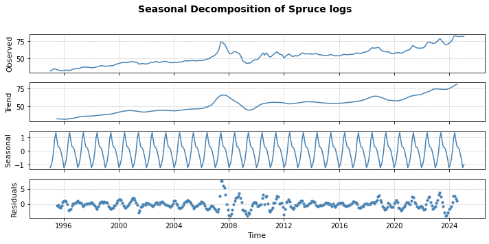
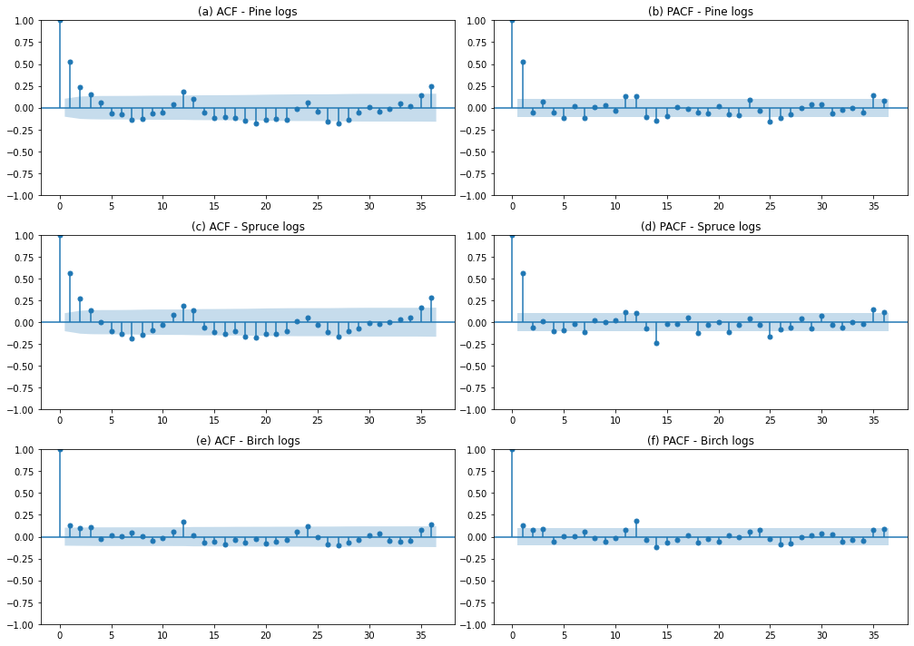

# Forestry Project: Forecasting Timber Prices in Finland Using SARIMA 
## Project Goal
This project analyzes and forecasts monthly timber prices for different tree species in Finland using SARIMA techniques. 
## Tools and Skills
- Python (pandas, numpy, matplotlib, seaborn, statsmodels)
- Time series modeling (SARIMA)
- Data wrangling and visualization
## Analysis workflow
1. Data cleaning
   - Extract data from [LUKE](https://statdb.luke.fi/PxWeb/pxweb/en/LUKE/LUKE__04%20Metsa__04%20Talous__02%20Teollisuuspuun%20kauppa__02%20Kuukausitilastot/01a_Kantohinnat_kk.px/?rxid=dc711a9e-de6d-454b-82c2-74ff79a3a5e0)
   - Handle missing values and removed irrelevant columns
2. Exploratory Data Analysis (EDA)
   - Visualize monthly price trends for pine, spruce, and birch logs
   - Conduct seasonal decomposition to inspect trend and seasonality patterns
3. Stationary and transform datasets
   - Apply ADF and KPSS tests to confrim stationarity
   - Go through log transformation and first differencing 
4. ACF and PACF visualization
   - Create autocorrelation (ACF) and partial autocorrelation (PACF) plots 
   - Idenfify candidate SARIMA model orders for each tree logs using ACF and PACF plots
5. AIC and BIC evaluation
   - Iterate over combinations of (p,d,q) and compute AIC and BIC to identify the best fitting model for each log.
   - Select the model with the lowest AIC or BIC as the final model.
   - Generate 12-month ahead forecasts using the best model for each log.
6. Model evaluation
   - Evaluate forecast accuracy using standard error metrics: Mean Absolute Error (MAE) and Root Mean Squared Error (RMSE) for overall model performance.
   - Perform rolling forecast origin cross-validation (3 folds) for each log to assess model robstness
   - Compare models across species based on mean and standard deviation of CV RMSE
7. Visualizations and results
   - Time series line charts by species
     
     **The trend of timber prices over time by specides**
   - Seasonal decomposition plots
     
     **Pine logs** 
     
     **Spruce logs**
     
     **Birch logs**
   - ACF / PACF plots
     
     **Used to determine SARIMA model parameters**
   - SARIMA forecasts with confidence bands (12 months)
     
     **Pine logs**
     
     **Spruce logs**
     
     **Birch logs**
   - Cross-validation RMSE comparison chart
     
     **Performance comparison across 3 folds using RMSE**
