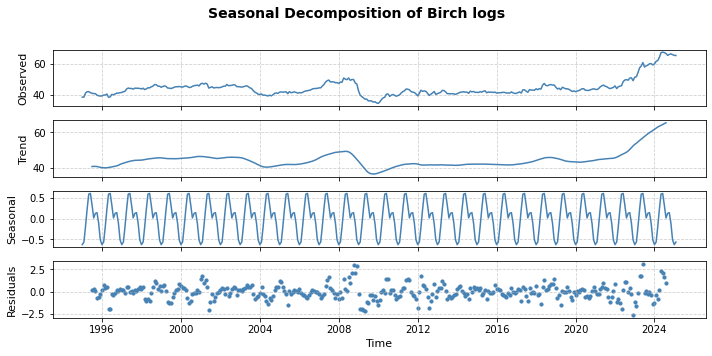

# Forestry Project: Forecasting Timber Prices in Finland Using SARIMA 
## Project Goal
This project analyzes and forecasts monthly timber prices for different tree species in Finland using SARIMA techniques. 
## Tools and Skills
- Python (pandas, numpy, matplotlib, seaborn, statsmodels)
- Time series modeling (SARIMA)
- Data wrangling and visualization
## Analysis workflow
### 1. Data overview and preparation

Timber price data is extracted from [LUKE](https://statdb.luke.fi/PxWeb/pxweb/en/LUKE/LUKE__04%20Metsa__04%20Talous__02%20Teollisuuspuun%20kauppa__02%20Kuukausitilastot/01a_Kantohinnat_kk.px/?rxid=dc711a9e-de6d-454b-82c2-74ff79a3a5e0) The dataset includes monthly standing sales prices (€) of three timber species in Finland: pine logs, spruce logs and birch logs. It spans from January 1995 to February 2025, covering a total of 362 months. Each log type has consistent data without missing values.

Pine logs have thighest average price (53.0 €), with prices ranging from 36.8 to 80.2 €. Spruce logs have slightly lower mean prices (52.7 €), but the largest variation. Birch logs are the least expensive (44.6€), with a narrower price spread.

Table 1. Statisitcs summary of timber prices with three logs
|       |   Pine logs |   Spruce logs |   Birch logs |
|-------|-------------|---------------|--------------|
| count |   362       |      362      |    362       |
| mean  |    53.0181  |       52.7452 |     44.5761  |
| std   |     9.02318 |       12.0068 |      5.63379 |
| min   |    38.58    |       31.53   |     34.72    |
| 25%   |    45.665   |       44.0625 |     41.425   |
| 50%   |    53.34    |       54.005  |     43.485   |
| 75%   |    56.675   |       58.7725 |     45.68    |
| max   |    80.19    |       83.31   |     67.36    |
### 2. Exploratory Data Analysis (EDA)
   - Visualize monthly price trends for pine, spruce, and birch logs

Figure 1. The trend of timber prices over time by specides

Figure 2. Seasonal decomposition of Pine logs 

Figure 3. Seasonal decomposition of Spruce logs

Figure 4. Seasonal decomposition of Birch logs

   - Conduct seasonal decomposition to inspect trend and seasonality patterns
4. Stationary and transform datasets
   - Apply ADF and KPSS tests to confrim stationarity
   - Go through log transformation and first differencing 
5. ACF and PACF visualization
   - Create autocorrelation (ACF) and partial autocorrelation (PACF) plots 
   - Idenfify candidate SARIMA model orders for each tree logs using ACF and PACF plots
6. AIC and BIC evaluation
   - Iterate over combinations of (p,d,q) and compute AIC and BIC to identify the best fitting model for each log.
   - Select the model with the lowest AIC or BIC as the final model.
   - Generate 12-month ahead forecasts using the best model for each log.
7. Model evaluation
   - Evaluate forecast accuracy using standard error metrics: Mean Absolute Error (MAE) and Root Mean Squared Error (RMSE) for overall model performance.
   - Perform rolling forecast origin cross-validation (3 folds) for each log to assess model robstness
   - Compare models across species based on mean and standard deviation of CV RMSE
8. Visualizations and results
   - Time series line charts by species

   - Seasonal decomposition plots

   - ACF / PACF plots
     
     **Used to determine SARIMA model parameters**
   - SARIMA forecasts with confidence bands (12 months)
     
     **Pine logs**
     
     **Spruce logs**
     
     **Birch logs**
   - Cross-validation RMSE comparison chart
     
     **Performance comparison across 3 folds using RMSE**
